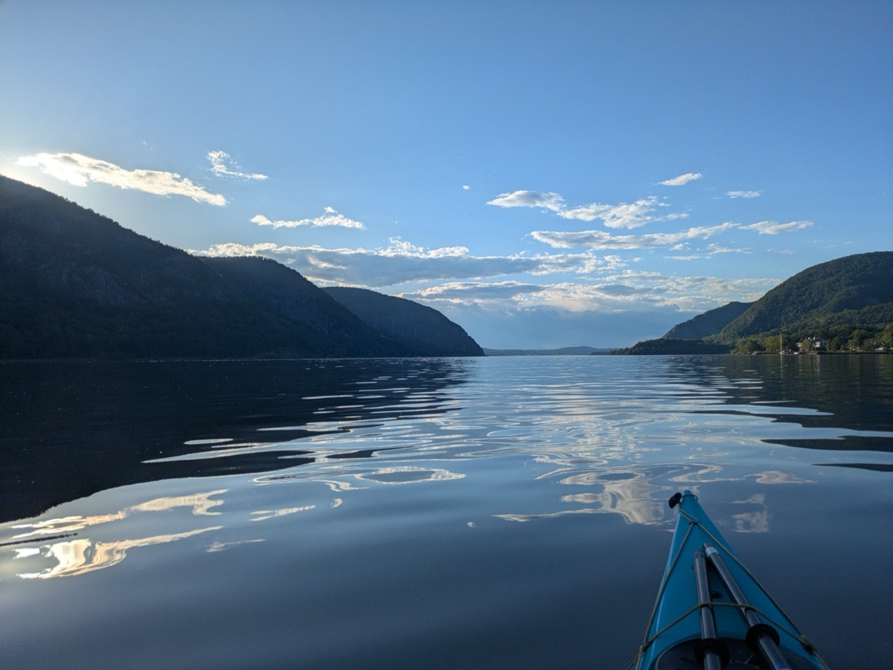

# Hudson River Paddling Conditions — Cold Spring, NY

A single-page app showing tide, current, and Constitution Marsh access conditions
for kayakers launching at Cold Spring, New York. It answers three questions a
paddler needs answered before pushing off, for right now or for any date through
2028.

**Live site:** _(add your deployed URL here)_



## What it shows

**River current** — speed in knots, ebb (south, downriver) or flood (north,
upriver), and the next slack or max with its speed.

**Tide** — height above MLLW, rising or falling, position in the cycle, and the
next high or low tide.

**Constitution Marsh access** — two independent gates, which is the part that
actually catches people out:

| | Problem | When |
|---|---|---|
| Crossing under the Metro-North trestle | The river rises against the trestle; no clearance | Within 2h of **high** tide |
| Paddling inside the marsh | The marsh drains to mud flat | Within 2h of **low** tide |

These never overlap — high and low tide here are always at least 4h 44m apart —
so the page can always say which one applies. A blocked crossing is not an
emergency if you are already inside: the water in the marsh is at its deepest
right then. You just wait for the trestle before heading back out. The summary
line spells out which constraint bites first and by when.

## How it works

Tides and tidal currents are driven by the positions of the moon and sun, so
NOAA publishes them years in advance. There is nothing live to fetch. That makes
the whole thing buildable as a static page with **no backend, no API calls at
runtime, and no network dependency once loaded** — which matters, because cell
service at the Cold Spring dock is unreliable.

```
scripts/fetch_predictions.py   NOAA API  ->  data/predictions.json   (run rarely)
scripts/build.py               template + data + photo  ->  index.html
```

### Data

Three years of predictions (2026–2028) for two NOAA stations, stored as **turning
points only** — high/low tides, and slack/max currents. About 12,700 events in
under 90 KB, delta-encoded so the numbers stay small.

- **Tides:** station 8518934 (Beacon), shifted 30 minutes earlier to approximate
  Cold Spring.
- **Currents:** station ACT3726_1 (West Point, off Duck Island), ~1.5 miles
  downriver and used unshifted.

Timestamps are converted from Eastern wall-clock to absolute epoch minutes at
fetch time, including the ambiguous hour when DST ends, so the page never has to
reason about time zones.

### Filling in between the turning points

Values between NOAA's published points are interpolated, and both methods were
validated against NOAA's own 6-minute data before shipping:

| Curve | Method | Mean error |
|---|---|---|
| Tide height | Cosine between successive high/low | 0.07 ft |
| Current speed | Quarter-sine anchored at slack | 0.02 kt |

The current one matters: reusing the cosine there — the obvious simplification —
is about eight times worse (0.17 kt). Don't "tidy" them into one function.

### A counterintuitive detail

Slack water is **not** high tide. At Cold Spring the current is running hardest
within about half an hour of high and low tide, and does not go slack until
roughly 2h 24m later. Launching at high tide expecting still water means
launching into the strongest flood of the cycle.

## Build it

No dependencies beyond the Python standard library.

```bash
python3 scripts/build.py                  # rebuild index.html from source
python3 scripts/fetch_predictions.py      # re-download predictions (needed before 2029)
```

Edit `src/template.html` for anything about the page itself — it is the real
source, and the only file you should hand-edit. `index.html` and `artifact.html`
are generated; changes made directly to them get overwritten on the next build.

## Deploy

`index.html` is entirely self-contained, so any static host works. Drag the
project folder onto [Netlify Drop](https://app.netlify.com/drop), or point
Cloudflare Pages or GitHub Pages at this repository.

## Limits

- **Predictions, not observations.** No wind, waves, barge traffic, upstream rain
  runoff, or storm surge — any of which can change conditions materially.
- **Predictions run out 31 Dec 2028.** After that the page says so rather than
  guessing. Re-run the fetch script to extend.
- The ±2h trestle and mud rules are local rules of thumb, not surveyed figures.

## Roadmap

- [ ] Air temperature, wind speed and direction
- [ ] Water temperature (relevant to cold-shock and immersion risk)
- [ ] A real deployed URL and custom domain

Both of those need live data, which means a runtime network call — a genuine
architectural change from the current offline-first design, and worth thinking
through rather than bolting on.
